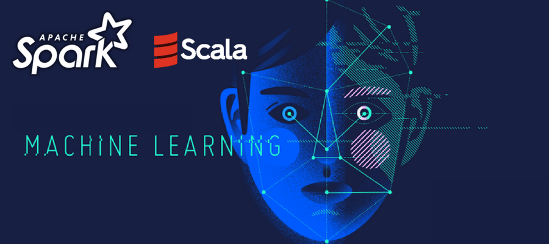

# MachineLearning-Spark-Scala

:sparkles::fireworks::tada: Important points about this Repository!!!!! :tada::fireworks::sparkles:

This Repository contains Machine Learning projects in Apache Spark using Native Supported Language Scala!

# Brief about Scala & why to choose Scala!
* It is the most rapidly growing programming language.

* One of the few pure functional languages available.

* Provides Conciseness in code.

* It is the native language for Apache Spark.

* Highly scalable & capable of writing the complex codes efficiently.

# Brief about Apache Spark & why to choose it!
* One of the most demanded Big Data Tool in the industry.

* Provides complete flexibility to the user to perform almost all the data science tasks due to the multiple tools and languages support.

* The Fastest tool to perform the task because it used In-Memory Computation Approach.

* Provides SQL, Machine Learning, Visualization, Streaming & Hive support to the user.

* Supports multiple languages like Java, R, Scala, & Python.

# Apache Spark Machine Learning Support!
* Apache Spark has a machine learning library dedicated for the machine learning tasks, it is very elegant & easy to use.

* It has the support for multiple machine learning algorithm categories like Regression, Clustering, Classification, Dimensionality Reduction, etc.
 
 
# License for this Repository!
**To check out the License [Click Here!](LICENSE)**   